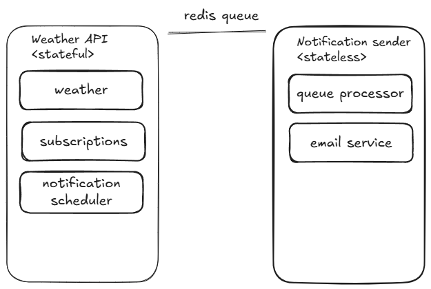

# Microservices Extraction

## Modules to Extract as Microservices

Based on the current application structure, the following modules are chosen to be extracted into a separate microservice:

### Notification Sender (Stateless)

- **queue processor**: Responsible for processing notification jobs from the queue
- **email service**: Handles the actual sending of emails

These components are stateless and can be scaled independently. They are decoupled from the main application logic and only require access to the queue and external email providers.

The optimal communication for the extracted services is:

**Redis Queue**: Weather API service schedules notification jobs and pushes them to a shared Redis queue. The Notification Sender service listens to this queue and processes jobs asynchronously

## Diagram

### Advantages

The main two advantages of moving to this microservices separation is improved **Scalability** and **Separation of Concerns** a little bit

### Disadvantages comparing to current monolith

**More things to manage**: managing multiple services adds overhead

### Considered options

Other variants considered included splitting out the weather or subscriptions modules into their own microservices, or creating more granular service boundaries. However, these alternatives would require significantly more changes to the codebase, introduce additional inter-service communication (such as HTTP/gRPC calls between services for weather data or subscription management), and increase operational complexity.

The chosen approach—extracting only the Notification Sender as a stateless microservice—was selected because it is the simplest to implement, requires the least amount of code changes, and does not require introducing new communication patterns beyond the existing Redis queue. This makes it the most optimal balance between benefits and complexity for the current project, allowing for improved scalability and separation of concerns without overcomplicating the architecture or deployment process.
