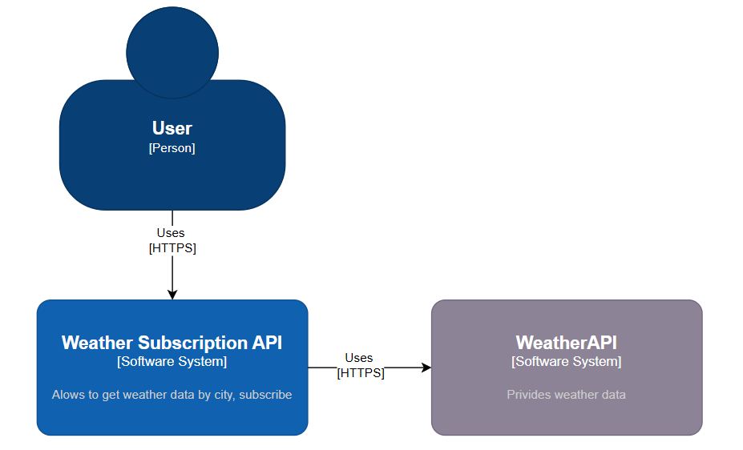
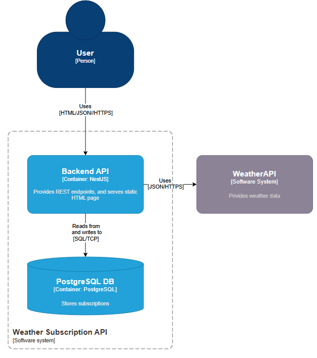
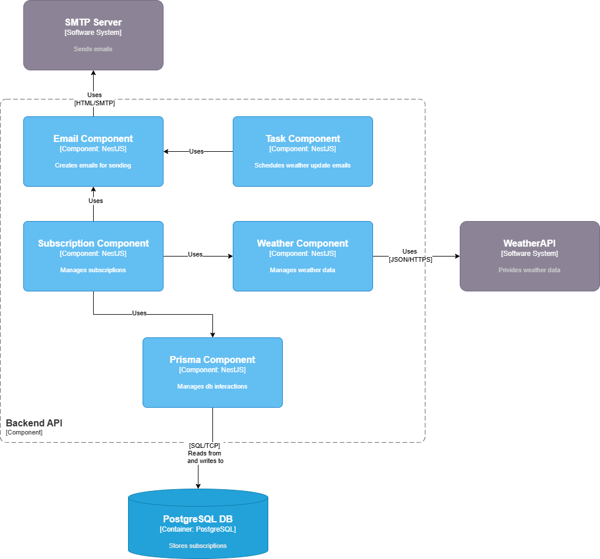
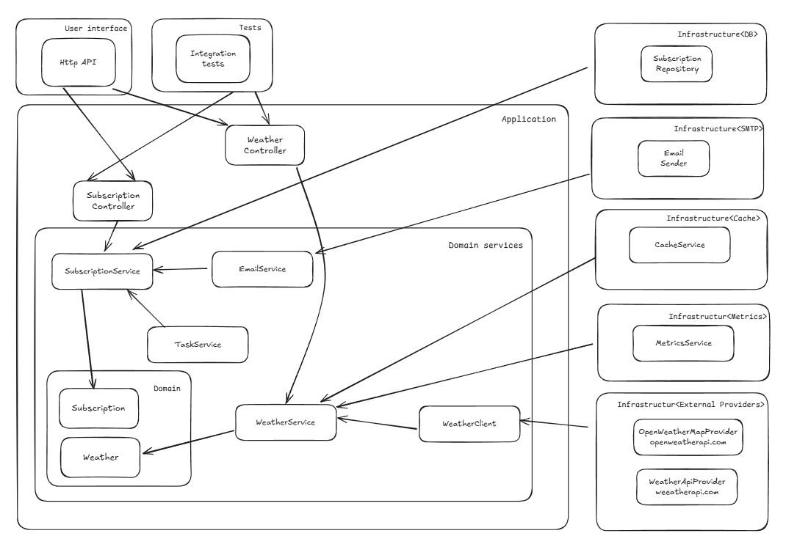

# System Design: Weather Subscription API

#### Status: Accepted

#### Date: 2025-06-08

#### Author: Mykola Tubolev

## 1. Requirements

### 1.1 Functional Requirements

- **Weather Retrieval**: Users can query current weather for a city via `GET /api/weather?city={city}`.
- **Subscription**: Users can subscribe to weather updates via `POST /api/subscribe` with email, city, and frequency (hourly/daily).
- **Confirmation**: Users confirm subscriptions via `GET /api/confirm/{confirmationToken}`.
- **Unsubscription**: Users unsubscribe via `GET /api/unsubscribe/{unsubscribeToken}`.
- **Email Notifications**: Send confirmation emails with a confirmation link and periodic weather updates with an unsubscription link.
- **Scheduling**: Send weather updates hourly (at :00) or daily (at 8 AM) based on subscription frequency.

### 1.2 Non-Functional Requirements

- **Scalability**: Handle up to 1,000 active subscriptions with efficient task queuing.
- **Performance**: API response time < 2 seconds for weather queries.
- **Logging**: Provide centralized and structured logging for monitoring, debugging, and troubleshooting system behavior.
- **Security**:
  - Input validation is enforced at the API layer.
  - Use unique, cryptographically secure tokens (UUID v4) for confirmation and unsubscription.

## 2. Architecture

### 2.1 Technology Stack

- **Backend**: NestJS for modular API development.
- **Database**: PostgreSQL for relational storage, managed via Prisma.
- **Email**: Nodemailer with Gmail's SMTP for sending emails.
- **Task Scheduling**: NestJS Schedule for cron jobs, BullMQ with Redis for queuing.
- **Testing**: Jest and Supertest with a in-memory solution for unit and e2e tests.
- **Deployment**: Docker and Docker Compose for local, Render for production.
- **Frontend**: HTML with Tailwind CSS and JavaScript for subscription page.
- **External Weather API**: Integrates with http://api.weatherapi.com/v1/ to retrieve current weather data for requested cities.

### 2.2 System Components

#### 2.2.1 C4 Diagrams

##### Level 1: System Context

##### Level 2: Container Diagram

##### Level 3: Component Diagram

#### 2.2.2 C4 Components Detailed Descriptions

- **Email Component**: Handles the creation and sending of emails, including confirmation and weather update notifications, using SMTP.
- **Task Component**: Schedules and triggers periodic weather update emails based on user subscription frequency.
- **Subscription Component**: Manages user subscriptions, including creation, confirmation, and unsubscription logic.
- **Weather Component**: Retrieves and manages weather data from the external WeatherAPI and provides it to other components.
- **Prisma Component**: Manages all database interactions using Prisma ORM, including reading and writing subscription data.

### 2.3 Database Schema

- **Table**: subscriptions
- **Fields**:
  - `id`: Serial (primary key, auto-incrementing)
  - `email`: String (unique, indexed, not null)
  - `city`: String (not null)
  - `frequency`: String (enum: 'hourly', 'daily', not null)
  - `confirmed`: Boolean (default: false, not null)
  - `confirmationToken`: String (unique, nullable, cleared after confirmation)
  - `unsubscribeToken`: String (unique, not null, persists until unsubscription)
  - `createdAt`: Timestamp (default: now(), not null)
  - `updatedAt`: Timestamp (updated on change, not null)
- **Indexes**: On `email`, `confirmationToken`, and `unsubscribeToken` for query performance.
- **Migrations**: Managed via Prisma's `migrate` command to initialize and update the schema.

### 2.4 Layered Architecture Diagram (Onion)

This architecture separates the system into distinct layers:

- **User Interface**: Exposes the HTTP API and integration tests.
- **Application Layer**: Contains controllers and services orchestrating business logic.
- **Domain Layer**: Encapsulates core business entities and logic (e.g., Subscription, Weather).
- **Infrastructure Layer**: Provides implementations for external dependencies such as database repositories, email sending, caching, metrics, and external weather providers.

Arrows indicate the direction of dependencies and interactions. The design enforces that inner layers (domain) do not depend on outer layers (infrastructure), promoting maintainability and testability.

## 3. API Specification

The API adheres to the Swagger spec provided, with the following endpoints:

- **GET /api/weather**
  - Query: `city` (required)
  - Returns: `{ temperature: number, humidity: number, description: string }`
  - Errors: 400 (invalid request), 404 (city not found)
- **POST /api/subscribe**
  - Body: `{ email: string, city: string, frequency: "hourly" | "daily" }`
  - Returns: `{ message: "Subscription successful. Confirmation email sent." }`
  - Errors: 400 (invalid input), 409 (email already subscribed)
- **GET /api/confirm/{confirmationToken}**
  - Path: `confirmationToken` (required)
  - Returns: `{ message: "Subscription confirmed successfully" }`
  - Errors: 400 (invalid token), 404 (token not found)
- **GET /api/unsubscribe/{unsubscribeToken}**
  - Path: `unsubscribeToken` (required)
  - Returns: `{ message: "Unsubscribed successfully" }`
  - Errors: 400 (invalid token), 404 (token not found)

## 4. Testing

- Unit and end-to-end (e2e) tests are provided.
- Tests should cover all major user flows, including weather retrieval, subscription, confirmation, unsubscription, and email notifications.
